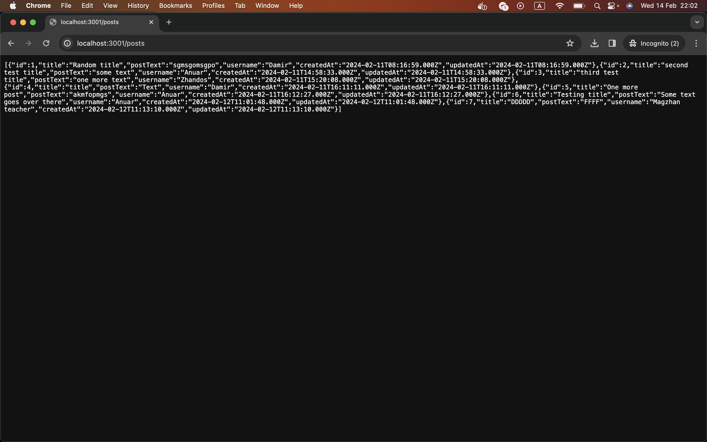
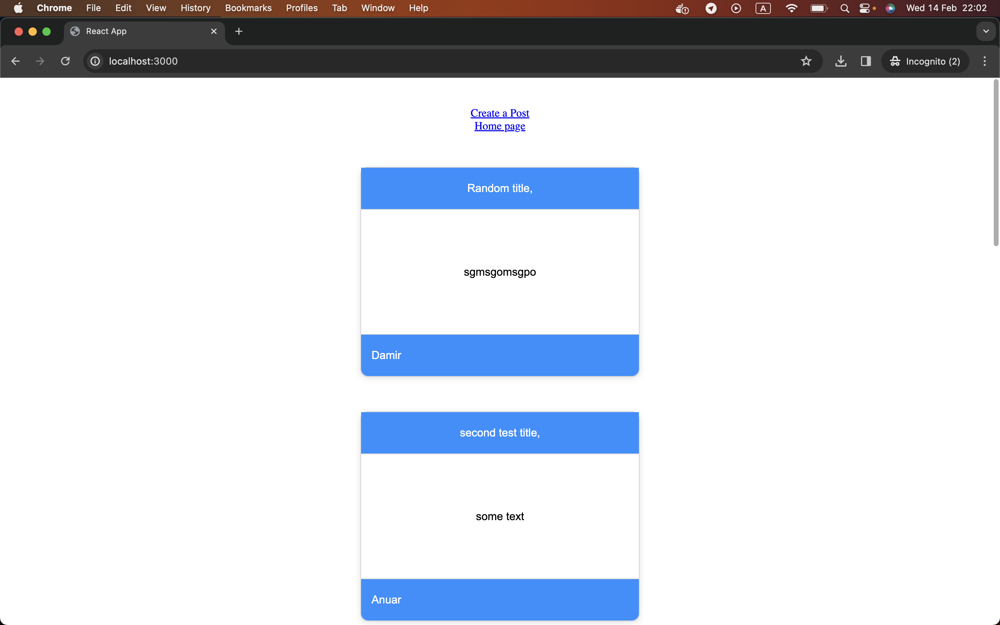
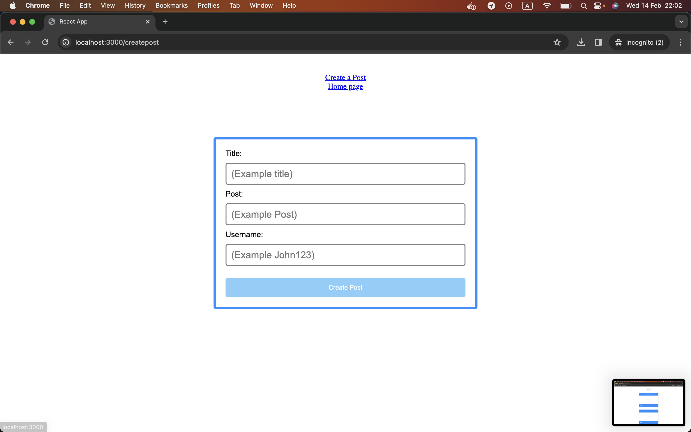

# Setup 

Head over to /client folder and type 
```
npm install
```
Do the same operation to /server folder

in order to launch type the following command
```
npm start
```
both server & client must be running together

# Screenshots

This is how looks like a server-side of my application, when I try to retrieve data from 



This is my front-end pages


